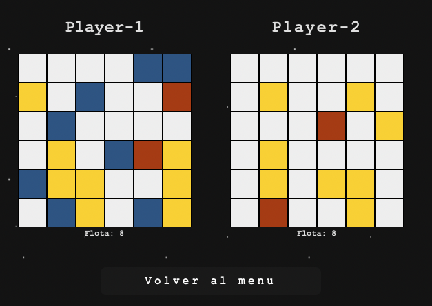
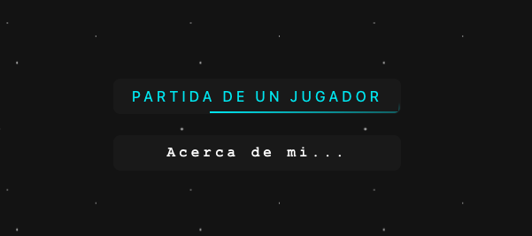
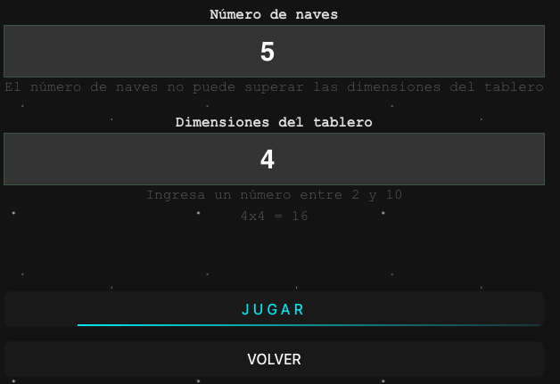

# Juego de Batalla Naval con React

Este es un proyecto de práctica para recrear de manera básica el juego de Batalla Naval para un jugador. Se ha construido utilizando Vite con dependencias mínimas, basándose únicamente en React y Redux. El lenguaje de programación utilizado es TypeScript.



### Requisitos

Se presume que el proyecto puede ejecutarse en otras versiones de Node y Npm, sin embargo, se desarrolló utilizando las siguientes versiones:

- Node: 18.16.0
- Npm: 9.6.5

Se recomienda encarecidamente utilizar Volta para detectar automáticamente las versiones de Node y Npm utilizadas por el proyecto. Puedes encontrar más información sobre Volta en su sitio web: [https://docs.volta.sh/](https://docs.volta.sh/)

### Instalación

Una vez que tengas las versiones correctas, simplemente ejecuta el siguiente comando:

```shell
npm i
```

### Instrucciones de uso

Después de la instalación, simplemente ejecuta el siguiente comando:

```
npm run dev
```

Esto ejecutará el proyecto en tu máquina local en: `http://localhost:5173/`

Al ingresar, estarás en el menú principal. En este menú, tendrás la opción de iniciar una partida o ver información sobre el desarrollador, como se muestra en la siguiente imagen:



Al iniciar una partida, deberás configurar el juego especificando el número de barcos disponibles y las dimensiones del tablero de juego, como se muestra en la siguiente imagen:



Finalmente, podrás jugar la partida. El esquema de colores es el siguiente:
- Blanco: Oculto.
- Azul: Nuestro barco.
- Amarillo: Disparo fallido.
- Rojo: Barco hundido.

<hr/>

#### Licencia
Este proyecto está bajo la Licencia MIT.
